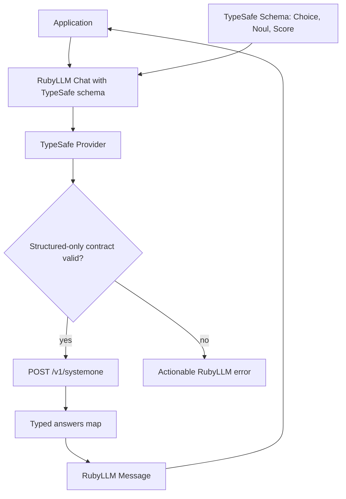
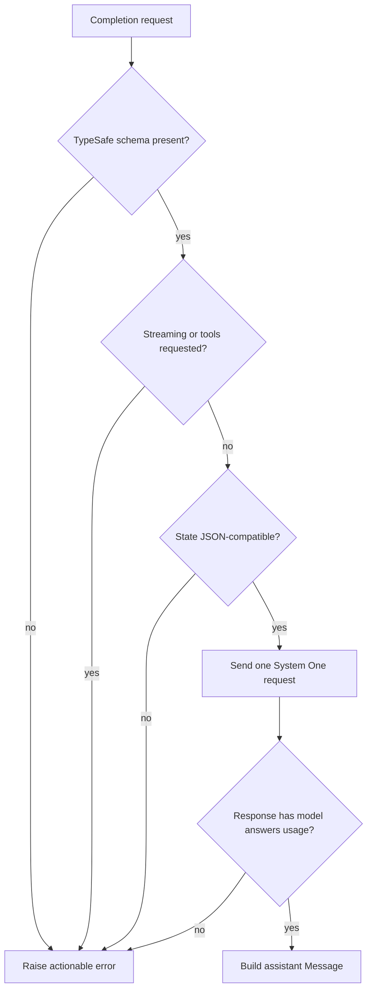

# RubyLLM TypeSafe provider plan

## Goal capsule

- **Objective:** Ship `ruby_llm-typesafe` 0.1.0 as an MIT-licensed RubyLLM 2 provider for TypeSafe System One structured judgments.
- **Authority:** The user-directed product decisions and live TypeSafe HTTP documentation override family conventions and reference-provider patterns.
- **Execution profile:** Implement every unit in dependency order, test the public API and wire contract, then simplify, review, publish a pull request, and make CI green.
- **Stop conditions:** Do not broaden the gem into chat or completions. Do not expose or persist live credentials. Stop if the documented TypeSafe HTTP contract and RubyLLM 2 provider contract cannot be reconciled without changing the product scope.
- **Tail ownership:** The LFG run owns implementation, review fixes, commit, push, pull request creation, and CI repair. It does not merge the pull request unless CI is green and the change is clearly complete.

---

## Product contract

### Summary

Create a public Ruby gem that lets RubyLLM 2 applications evaluate text or structured state with TypeSafe's System One endpoint.
The provider exposes TypeSafe's `Choice`, `Noul`, and `Score` judgments as a RubyLLM structured-output schema.
It returns the documented typed answer objects through `RubyLLM::Message#parsed` and does not pretend to support generated chat text.

### Problem frame

TypeSafe publishes Python and JavaScript SDKs but no Ruby SDK.
Ruby applications that standardize on RubyLLM therefore need custom HTTP code and cannot use RubyLLM's provider configuration, model resolution, messages, token accounting, or structured-output entry point.
TypeSafe is not a text-generation service: Jev evaluates one state against one or more independent typed questions.
The integration must preserve that semantic boundary instead of forcing the endpoint into a general chat protocol.

### Requirements

**Packaging and compatibility**

- R1. The public gem and repository are named `ruby_llm-typesafe`, begin at version `0.1.0`, and use the MIT license. (session-settled: user-directed, chosen over a private EveryInc repository: the user requested an open-source gem in the existing `ruby_llm-*` family.)
- R2. The gem supports RubyLLM 2 only with a dependency range that includes `2.0.0.rc3` and excludes RubyLLM 3. (session-settled: user-directed, chosen over RubyLLM 1.x compatibility: the user required RubyLLM 2 only.)
- R3. The gem supports the Ruby versions covered by the RubyLLM 2 and reference-provider baseline, starting at Ruby 3.1.3.
- R4. Requiring `ruby_llm-typesafe` registers a `:typesafe` provider and its packaged TypeSafe model metadata without modifying RubyLLM.

**System One contract**

- R5. The provider sends `POST /v1/systemone` to `https://api.typesafe.ai` by default with Bearer authentication, JSON content, the selected model, one state, and a nonempty question map.
- R6. The provider models `Choice`, `Noul`, and `Score` as distinct typed judgments with the documented instructions, criteria, and answer fields.
- R7. Instructions, Choice option descriptions, Score level descriptions, Noul true/false descriptions, and state accept JSON-compatible strings, objects, arrays, or null where the live TypeSafe contract permits them.
- R8. A request may batch independent mixed question types over the same state and preserves caller-defined question IDs in the returned answer map.
- R9. The default documented model is `jev-latest`; callers may select another TypeSafe model identifier through RubyLLM's model argument when it is present in the packaged catalog or explicitly assumed by RubyLLM.

**RubyLLM structured-output behavior**

- R10. The provider operates only when `Chat#with_schema` receives this gem's TypeSafe schema; plain chat, arbitrary JSON schemas, streaming, and tools fail with actionable errors. (session-settled: user-directed, chosen over a general chat/completions provider: TypeSafe is required to be a structured-output-only provider.)
- R11. The schema builder validates question IDs and per-primitive criteria before any network request and produces a JSON Schema that describes the documented typed answer map.
- R12. The latest user message supplies string state by default; message content that is a JSON object or array is decoded into structured state (JSON scalars such as `42` or `true` stay strings because TypeSafe state is `string | object | array`), and `with_provider_options(state: ...)` may supply an explicit JSON-compatible state (`provider_options` is System One's own wire vocabulary, as in every RubyLLM provider).
- R13. A successful request returns an assistant `RubyLLM::Message` whose JSON content is the TypeSafe `answers` map, whose model and token fields reflect the response, and whose raw value retains the complete HTTP response.
- R14. Each `ask` is an independent System One evaluation; prior assistant output is not turned into hidden conversational context.

**Reliability and security**

- R15. TypeSafe validation, authentication, rate-limit, overload, and server errors surface through appropriate RubyLLM error classes with the service's safe error message.
- R16. Retryable `429` and `529` responses use RubyLLM's configured bounded HTTP retry behavior, including standard `Retry-After` handling.
- R17. The API key is configured through `typesafe_api_key`, is sent only in the authorization header, and is never committed, logged by the gem, embedded in examples, or recorded in test fixtures.
- R18. Offline tests verify schema validation, request mapping, response mapping, unsupported behavior, configuration, error mapping, and retry integration without a real credential.
- R19. An opt-in live test uses only `TYPESAFE_API_KEY` from the process environment and evaluates all three primitive types in one System One request.
- R20. CI runs the offline test suite and style checks across the supported Ruby matrix without requiring secrets.

### Acceptance examples

- AE1. Covers R6, R8, R12, and R13.
  - **Given:** A schema with one Noul, one Choice, and one Score plus a JSON object state.
  - **When:** The application calls `ask` with `jev-latest`.
  - **Then:** One HTTP request carries all three questions and `response.parsed` returns three matching typed answers.
- AE2. Covers R10.
  - **Given:** A `:typesafe` chat without a TypeSafe schema.
  - **When:** The application calls `ask`.
  - **Then:** The call fails before network access and explains that TypeSafe supports structured judgments only.
- AE3. Covers R15 and R16.
  - **Given:** The endpoint first returns a retryable overload response and then succeeds.
  - **When:** RubyLLM retries the evaluation.
  - **Then:** The caller receives the typed answer; an exhausted overload raises `RubyLLM::OverloadedError`.
- AE4. Covers R17 and R19.
  - **Given:** `TYPESAFE_API_KEY` is absent.
  - **When:** The default suite runs.
  - **Then:** No live request runs and no credential is required.

### Scope boundaries

- Structured System One evaluation only.
- No free-form chat, completions, generated explanations, embeddings, images, audio, moderation, tools, or streaming.
- No Ruby implementation of TypeSafe's complete Python or JavaScript SDK surface.
- No model-list endpoint, asynchronous job API, browser client, or credential persistence.
- No automatic action thresholds or business policy; callers own how probabilities and confidence affect behavior.
- No default assumption that a TypeSafe judgment is true; typed output constrains shape, not correctness.

### Deferred to follow-up work

- Optional model discovery if TypeSafe publishes and documents a stable HTTP model-list endpoint suitable for provider catalogs.
- A higher-level convenience evaluator if real usage shows that RubyLLM's schema and provider-options composition is too verbose.
- Additional retry policy controls beyond RubyLLM's existing transport configuration.

---

## Planning contract

### Key technical decisions

- KTD1. **Use a dedicated TypeSafe schema object as the RubyLLM integration seam.** The schema builder embeds the question definitions in a namespaced JSON Schema extension that survives RubyLLM 2 normalization; the provider extracts it and sends only the documented question payload. This implements R6, R10, and R11 without monkey-patching `RubyLLM::Chat`.
- KTD2. **Return the `answers` map as message content and retain the full response as raw data.** `Message#parsed` becomes the ergonomic structured result while response model and usage use RubyLLM's standard fields. This implements R13 without duplicating model and usage inside the parsed business value.
- KTD3. **Use RubyLLM's Faraday transport rather than a second HTTP stack.** The provider supplies its base URL and authorization header, then performs the documented relative POST directly. RubyLLM owns JSON serialization, timeouts, proxies, retry limits, `Retry-After`, and HTTP-to-error mapping for R5, R15, and R16.
- KTD4. **Package a minimal `jev-latest` model catalog.** The entry advertises text input, structured output, and no unsupported capabilities. Explicit unknown models remain available only through RubyLLM's caller-controlled assume-model mechanism. This avoids falsely advertising streaming and tool support.
- KTD5. **Treat each call as one evaluation and derive state only from the latest user turn or an explicit provider override.** Prior turns are transport history, not System One state. Callers who need a conversation evaluated pass the conversation as structured state. This implements R12 and R14.
- KTD6. **Validate JSON compatibility and primitive invariants locally.** Choice requires a nonempty option map, Score requires at least two ordered levels, Noul accepts only optional true/false criteria, and all questions require a stable nonempty ID and instructions key. Service-side validation remains authoritative for limits not stated in live docs.
- KTD7. **Keep the live test opt-in and outside CI.** The test reads `TYPESAFE_API_KEY` only at runtime, uses harmless synthetic state, and never records the response as a fixture. This implements R17 through R20.
- KTD8. **Use MIT and version 0.1.0.** (session-settled: user-directed, chosen over delaying license/version selection: MIT is the repository-family default and the user named 0.1.0 as the open-area default.)

### High-level technical design

The public DSL, provider boundary, and response path form one constrained flow:



The schema extension carries question metadata while the visible JSON Schema carries the answer contract:

```text
TypeSafe schema builder
  question id
    primitive type
    instructions
    criteria
  generated answer schema
    typed answer fields
    primitive-specific bounds
  private namespaced extension
    original TypeSafe question map
```

The provider applies these request gates in order:



### Output structure

Amended after planning: the user asked for the layout, tooling, and testing conventions of the upstream `crmne/ruby_llm` provider gems (`ruby_llm provider-gem`), so the provider lives under `lib/ruby_llm/providers/`, the wire format under `lib/ruby_llm/protocols/`, and live specs replay VCR cassettes.

```text
ruby_llm-typesafe/
├── .github/{dependabot.yml, pull_request_template.md, workflows/{ci,gitleaks,release}.yml}
├── .env.example .gitignore .overcommit.yml .rspec .rubocop.yml Archspec.rb
├── CHANGELOG.md CODE_OF_CONDUCT.md CONTRIBUTING.md LICENSE README.md
├── Gemfile Rakefile ruby_llm-typesafe.gemspec models.json
├── bin/{console, setup}
├── tasks/{models, vcr}.rake
├── docs/plans/2026-09-16-001-feat-typesafe-provider-plan.md
├── lib/
│   ├── ruby_llm-typesafe.rb                       # hyphenated require shim
│   └── ruby_llm/
│       ├── providers/typesafe.rb                  # RubyLLM::Providers::TypeSafe: auth, base, errors, VERSION, registration
│       ├── providers/typesafe/schema.rb           # RubyLLM::Providers::TypeSafe::Schema: noul / choice / score builder
│       ├── providers/typesafe/schema/answers.rb   # JSON Schema for each typed answer
│       ├── protocols/system_one.rb                # RubyLLM::Protocols::SystemOne: guards, provider_options state
│       ├── protocols/system_one/chat.rb           # render_payload, parse_completion_body, state derivation
│       └── protocols/system_one/models.rb         # GET v1/models catalog parsing
└── spec/
    ├── spec_helper.rb
    ├── support/{models, rspec_configuration, rubyllm_configuration, typesafe_helpers, vcr_configuration}.rb
    ├── fixtures/vcr_cassettes/*.yml              # scrubbed live recordings
    ├── ruby_llm_typesafe_gemspec_spec.rb
    └── ruby_llm/
        ├── chat_schema_spec.rb chat_error_spec.rb  # :live, through RubyLLM.chat(...).with_schema(...).ask(...)
        ├── error_handling_spec.rb models_spec.rb
        ├── providers/typesafe_spec.rb
        ├── providers/typesafe/schema_spec.rb + schema/{noul,choice,score}_spec.rb
        └── protocols/system_one_spec.rb + system_one/{chat,models}_spec.rb
```

### Risks and dependencies

- The gem depends on RubyLLM 2's provider registration, schema normalization, model catalog, transport, message, and error contracts. Tests must pin these integration seams against `>= 2.0.0.rc3, < 3`.
- TypeSafe may evolve the System One payload or typed answers. The live docs are authoritative; wire-contract tests should use only documented fields and the README should link to the live HTTP reference.
- RubyLLM's default assumed model metadata advertises broad chat capabilities. The packaged catalog and explicit unsupported-feature guards prevent that metadata from becoming behavior.
- RubyLLM debug logging may include request bodies. The gem must not add its own body or credential logging, and documentation should remind applications that evaluated state can be sensitive.
- A live model response is probabilistic. The live test must assert response shape and bounds, not an exact classification.

### Sources and research

- TypeSafe agent skill: `https://raw.githubusercontent.com/typesafe-ai/skills/main/skills/typesafe-ai/SKILL.md`
- TypeSafe documentation index: `https://docs.typesafe.ai/llms.txt`
- TypeSafe HTTP API: `https://docs.typesafe.ai/api.md`
- TypeSafe System One, state, primitives, advanced structure, and confidence pages under `https://docs.typesafe.ai/`
- RubyLLM 2 provider, chat schema, transport, errors, model registry, and custom-provider guide from `crmne/ruby_llm` at version `2.0.0.rc3`
- Provider-family references: `kieranklaassen/ruby_llm-cursor` and `kieranklaassen/ruby_llm-skills`

---

## Implementation units

### U1. Gem scaffold, model catalog, and quality baseline

**Goal:** Create a loadable versioned gem with the RubyLLM 2 dependency, MIT license, model metadata, local quality tasks, and CI.

**Requirements:** R1-R4, R20; KTD4, KTD8

**Dependencies:** None

**Files:**

- Create `ruby_llm-typesafe.gemspec`, `Gemfile`, `Rakefile`, `LICENSE`, `.gitignore`, `.rspec`, and `.rubocop.yml`.
- Create `models.json`.
- Create `lib/ruby_llm-typesafe.rb`, `lib/ruby_llm/typesafe.rb`, and `lib/ruby_llm/typesafe/version.rb`.
- Create `.github/workflows/ci.yml`.
- Create `spec/spec_helper.rb` and `spec/ruby_llm/typesafe/version_spec.rb`.

**Approach:**

1. Mirror the packaging and require-shim shape of `ruby_llm-cursor`.
2. Set version `0.1.0`, Ruby `>= 3.1.3`, and RubyLLM `>= 2.0.0.rc3, < 3`.
3. Package all library files, the model catalog, README, and license.
4. Define a `jev-latest` catalog entry with only supported text and structured-output metadata.
5. Run RSpec and RuboCop from the default Rake task and in CI on Ruby 3.1 through 3.4.

**Patterns to follow:** `ruby_llm-cursor.gemspec`, its require shim and CI workflow, plus RubyLLM 2's provider-gem catalog registration guide.

**Test scenarios:**

- Requiring the hyphenated gem entrypoint loads the namespace and semantic version.
- The gemspec dependency accepts RubyLLM `2.0.0.rc3` and a future 2.x release but rejects 1.x and 3.x.
- The packaged catalog resolves `jev-latest` as a TypeSafe structured-output model without streaming or tool capabilities.
- Building the gem includes the required runtime files, catalog, README, and license.

**Verification:** The gem builds, can be required from a clean process, exposes version `0.1.0`, and its offline quality task passes.

### U2. Typed judgment and schema builder

**Goal:** Provide a public schema API for batched Choice, Noul, and Score questions that validates inputs and emits the output contract.

**Requirements:** R6-R8, R10-R11, R17-R18; KTD1, KTD6

**Dependencies:** U1

**Files:**

- Create `lib/ruby_llm/typesafe/schema.rb`.
- Create `spec/ruby_llm/typesafe/schema_spec.rb`.

**Approach:**

1. Implement a small builder with named `choice`, `noul`, and `score` entries.
2. Normalize question IDs and JSON-compatible values without mutating caller data.
3. Generate primitive-specific answer schemas and a top-level required answer map.
4. Preserve the TypeSafe question payload in one namespaced schema extension for provider extraction.
5. Raise `ArgumentError` before network use for invalid IDs, missing instructions, malformed criteria, duplicate questions, unsupported values, or an empty schema.

**Patterns to follow:** RubyLLM 2 `Chat#with_schema` and schema normalization; TypeSafe's live primitive and advanced-structure pages.

**Test scenarios:**

- A mixed schema emits all three documented question payloads and answer field shapes.
- Choice accepts JSON-compatible option descriptions and rejects an empty or non-map criteria value.
- Score accepts structured levels, preserves order, and rejects fewer than two levels.
- Noul accepts omitted criteria or a true/false map and rejects unrelated criteria keys.
- Structured instructions and criteria survive a JSON round trip without caller-data mutation.
- Empty, duplicate, or unsafe question IDs fail with an actionable argument error.
- NaN, infinity, symbols in values, and arbitrary Ruby objects fail as non-JSON-compatible input.

**Verification:** Schema specs prove the public DSL, generated JSON Schema, hidden question map, validation boundaries, immutability, and JSON serialization.

### U3. Provider registration and HTTP request/response mapping

**Goal:** Register a configured `:typesafe` provider that sends documented System One requests and returns RubyLLM messages with typed answers and usage.

**Requirements:** R4-R9, R12-R16; KTD2-KTD5

**Dependencies:** U1, U2

**Files:**

- Create `lib/ruby_llm/typesafe/provider.rb`.
- Modify `lib/ruby_llm/typesafe.rb`.
- Create `spec/ruby_llm/typesafe/provider_spec.rb`.
- Create `spec/support/typesafe_responses.rb`.

**Approach:**

1. Register `:typesafe` with `typesafe_api_key` and `typesafe_api_base` configuration plus the packaged catalog.
2. Use RubyLLM's connection with the default `https://api.typesafe.ai` base and a Bearer authorization header.
3. Extract questions only from the TypeSafe schema extension and derive state from the explicit `provider_options[:state]` override or the latest user message.
4. Parse user content that is a JSON object or array as structured state and otherwise preserve it as a string.
5. POST the documented model, state, and questions payload to `v1/systemone`.
6. Build a stopped assistant message containing only the answer map as JSON while retaining model, token usage, and raw response.

**Patterns to follow:** RubyLLM 2 `Provider`, `Transport::Connection`, `Message`, and provider registration; `ruby_llm-cursor` external-provider registration and construction tests.

**Test scenarios:**

- Provider registration exposes the expected configuration options and model catalog.
- Missing configuration raises `RubyLLM::ConfigurationError` without leaking credential data.
- A string state produces the exact documented URL, headers, model, and mixed question payload.
- JSON object and array user content become structured state; malformed JSON and JSON scalars stay strings.
- An explicit provider state overrides user text and supports string, object, and array values; other provider options merge into the payload.
- A response maps answers, model, input tokens, output tokens, finish reason, and raw HTTP response correctly.
- Multiple calls on one chat send only each latest state and do not embed prior answers.
- A custom API base and caller headers are honored without replacing authorization.

**Verification:** Stubbed HTTP contract specs prove exact request and response mapping through RubyLLM's real connection middleware.

### U4. Structured-only guards, errors, and retry behavior

**Goal:** Make unsupported RubyLLM behaviors fail explicitly and prove TypeSafe service failures retain RubyLLM semantics.

**Requirements:** R10, R14-R18; KTD3, KTD5

**Dependencies:** U3

**Files:**

- Modify `lib/ruby_llm/typesafe/provider.rb`.
- Create `spec/ruby_llm/typesafe/integration_spec.rb`.
- Modify `spec/ruby_llm/typesafe/provider_spec.rb`.

**Approach:**

1. Reject missing schemas and arbitrary JSON schemas before opening the connection.
2. Reject streaming blocks and nonempty RubyLLM tools with a provider-specific unsupported-feature message.
3. Reject malformed successful bodies that omit the documented model, answers, or usage shape.
4. Exercise RubyLLM transport mapping for `401`, `422`, `429`, `529`, and server errors.
5. Prove bounded retry and `Retry-After` behavior without weakening RubyLLM's global retry policy.

**Patterns to follow:** RubyLLM 2 error middleware and retry configuration; TypeSafe HTTP API error table.

**Test scenarios:**

- Covers AE2. Plain `ask`, an ordinary JSON Schema, streaming, and tools each fail before HTTP.
- Unsupported chat history is not sent as hidden state; only the latest user turn is evaluated.
- A `401` becomes `RubyLLM::UnauthorizedError`, `422` preserves an actionable validation error, `429` becomes `RubyLLM::RateLimitError`, and `529` becomes `RubyLLM::OverloadedError`.
- A retryable response followed by success returns one typed message after the configured bounded retry.
- Exhausted retries raise the final RubyLLM error and do not expose the authorization value.
- A malformed 2xx body raises a clear provider response error.

**Verification:** Full offline integration specs traverse RubyLLM chat, provider, transport, error middleware, and message parsing with no network leakage.

### U5. User documentation and opt-in live proof

**Goal:** Document installation and safe usage, then prove the released API against the live TypeSafe service without persisting secrets or probabilistic outputs.

**Requirements:** R5-R10, R12-R14, R17, R19-R20; KTD7

**Dependencies:** U1-U4

**Files:**

- Replace `README.md`.
- Create `spec/ruby_llm/typesafe/live_spec.rb`.
- Modify `.rspec` or `spec/spec_helper.rb` to exclude live tests by default.

**Approach:**

1. Explain the structured-output-only boundary before showing usage.
2. Document configuration through `TYPESAFE_API_KEY` without any example value.
3. Show one mixed Choice, Noul, and Score schema with string state and one structured-state example.
4. Explain the typed answer fields, confidence distinction, independent questions, and caller-owned action thresholds.
5. Document unsupported features, default model, custom base URL, testing commands, and live-test opt-in.
6. Add one harmless live request that checks types, IDs, probability bounds, usage, and model shape rather than exact judgments.

**Patterns to follow:** `ruby_llm-cursor` README structure and live-spec tagging; TypeSafe quickstart, primitives, state, confidence, and HTTP API pages.

**Test scenarios:**

- README snippets use the public gem API and contain no credential-shaped value.
- The normal suite skips the live example when `TYPESAFE_API_KEY` is absent.
- Covers AE1 and AE4. With the environment variable present, one request returns valid Noul, Choice, and Score answer shapes with bounded probabilities.
- The live test does not write response fixtures, snapshots, logs, or store artifacts.

**Verification:** Documentation examples run as offline smoke tests where practical, the secret scan is clean, the default suite passes without credentials, and the explicit live test passes with a process-only `TYPESAFE_API_KEY`.

---

## Verification contract

| Gate | Applies to | Done signal |
|---|---|---|
| Dependency install | U1-U5 | Bundler resolves RubyLLM `>= 2.0.0.rc3, < 3` and development dependencies on the local supported Ruby. |
| Offline specs | U1-U5 | All RSpec examples except `:live` pass with network connections disabled unless explicitly stubbed. |
| Style | U1-U5 | RuboCop reports no offenses. |
| Gem build | U1 | `gem build ruby_llm-typesafe.gemspec` succeeds and the artifact contains the declared runtime files. |
| Runtime smoke | U1, U3, U4 | A clean Ruby process requires the gem, configures `:typesafe`, resolves `jev-latest`, and builds a chat. |
| Live System One | U5 | The opt-in live spec passes once with `TYPESAFE_API_KEY` supplied only to the test process. |
| Secret hygiene | U1-U5 | Git-tracked content and the final diff contain no API key or credential value. |
| CI | U1-U5 | Every required GitHub Actions matrix job passes on the pull request. |

---

## Definition of done

- Every requirement R1-R20 is implemented or proven by an explicit test or documentation assertion.
- U1-U5 are complete in dependency order and no implementation unit remains partial.
- The public schema and provider APIs are demonstrated in the README and match the tested behavior.
- The live TypeSafe HTTP contract is exercised once with a process-only credential; no secret or response artifact is persisted.
- Offline specs, RuboCop, gem build, runtime smoke, secret hygiene, and GitHub Actions all pass.
- Simplification and code review leave no actionable correctness, security, maintainability, or documentation findings.
- The branch contains no abandoned experiments, generated gem artifacts, temporary files, or unrelated workspace changes.
- The implementation is committed, pushed, and represented by an open pull request against `main`.
- The pull request is not merged unless CI is green and the complete diff clearly satisfies this plan.
